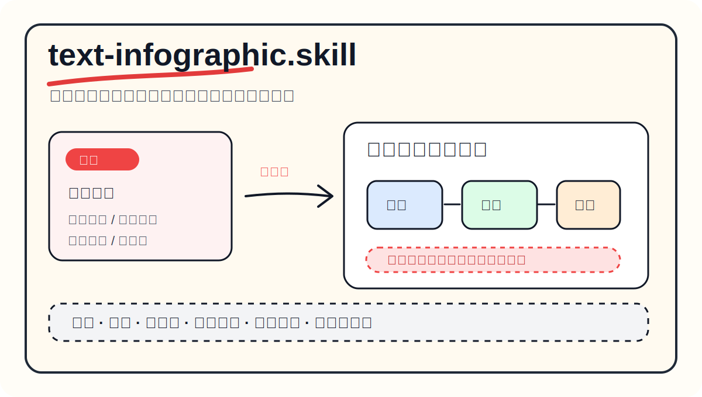
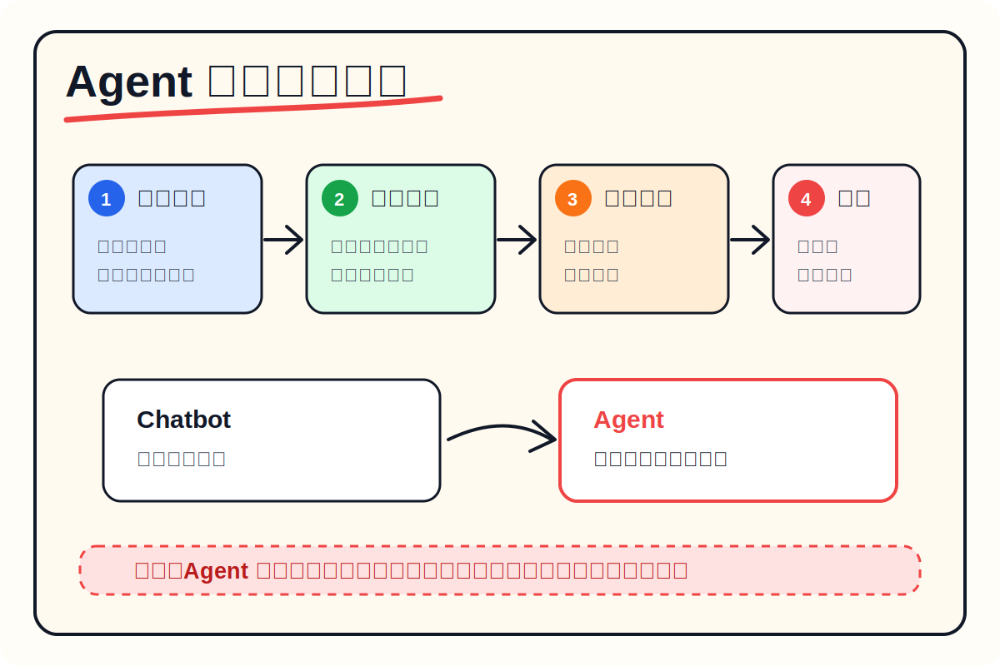
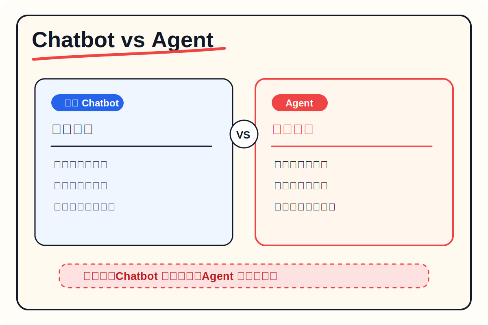

<div align="center">

# text-infographic.skill

<p align="center">
  
</p>

> 输入一段文字，输出一张像课程白板一样清楚、克制、可传播的信息制图。

[](LICENSE)
[](SKILL.md)
[](references/style-guide.md)

<br>

**把段落、课程笔记、文章片段、产品说明，自动压缩成统一风格的中文信息制图。**

这个 skill 提炼自《智能体应用与 skill 开发实战》里的信息图风格：白底教学板、手写感标题、黑色线框、红色重点、彩色标签、圆角模块、箭头关系、底部总结条。

[看效果](#效果示例) · [安装](#安装) · [怎么用](#怎么用) · [它生成什么](#它生成什么) · [工作原理](#工作原理)

</div>

---

## 效果示例

输入一段普通文字：

```text
Agent 不只是聊天机器人，而是能调用工具、操作文件、运行代码、自动完成复杂任务的 AI 助手。
```

输出一张结构化信息制图：

<p align="center">
  
</p>

再换一个更适合对比的输入：

```text
传统 Chatbot 主要负责回答问题，Agent 则能拆解目标、选择工具、执行步骤，并根据结果继续调整行动。
```

<p align="center">
  
</p>

这些示例是仓库内的静态 SVG，用来展示视觉方向。实际使用时，skill 会根据你的输入生成适合图像模型的完整 prompt，再由图像模型产出同风格图片。

---

## 安装

如果你的环境支持 `skills` CLI：

```bash
npx skills add zhanglijiasy-eng/text-infographic-skill
```

也可以手动安装：

```bash
git clone https://github.com/zhanglijiasy-eng/text-infographic-skill.git
mkdir -p ~/.codex/skills
cp -R text-infographic-skill ~/.codex/skills/text-infographic
```

然后在 Codex 里直接说：

```text
使用 text-infographic skill，把下面这段文字生成一张信息制图：

Agent 不只是聊天机器人，而是能调用工具、操作文件、运行代码、自动完成复杂任务的 AI 助手。
```

---

## 怎么用

最自然的用法是直接给一段文字：

```text
把这段课件文字做成《智能体应用与 skill 开发实战》同款信息制图：

Agent 的关键能力不是聊天，而是感知上下文、调用工具、执行动作，并根据反馈继续推进任务。
```

如果你想先得到稳定的图像生成 prompt，可以运行脚本：

```bash
python scripts/build_prompt.py --text "你的输入文字" --layout system-map
python scripts/build_prompt.py --file input.txt --layout dense-cheatsheet
```

支持的布局：

| 布局 | 适合内容 |
|---|---|
| `explainer-flow` | 问题 -> 机制 -> 结果 |
| `system-map` | 组件、架构、能力模块、方法框架 |
| `comparison` | A vs B、旧方式 vs 新方式、Chatbot vs Agent |
| `dense-cheatsheet` | 信息量较大的课程笔记、清单、速查表 |

---

## 它生成什么

这个 skill 不是简单把文字贴到图上，而是先把输入压缩成可视化结构：

| 层次 | 说明 |
|---|---|
| **标题** | 把段落提炼成一个醒目的中文标题 |
| **模块** | 拆成 3-5 个短标签区块，每个区块只保留关键信息 |
| **关系** | 用箭头、编号、对比栏或流程线表达逻辑 |
| **重点** | 只把最高价值的一句话或关键词标红 |
| **总结** | 底部给出一句可传播的结论 |

视觉上保持同一套系统：

- 白色或暖白色 3:2 横版画布
- 顶部大号手写感中文标题
- 黑色 marker 风格线条
- 红色强调主结论
- 蓝、绿、橙等轻量色块做分区
- 简单线性图标和箭头
- 底部虚线总结条

---

## 工作原理

输入一段文字后，skill 做四件事：

**1. 语义压缩**  
去掉冗余表达，把原文压成一个核心观点、3-5 个模块和一句结论。

**2. 结构选择**  
根据文本类型选择 `explainer-flow`、`system-map`、`comparison` 或 `dense-cheatsheet`。

**3. 风格约束**  
套用 `references/style-guide.md` 里的统一视觉规范，保证每次输出都像同一套课程图。

**4. Prompt 生成**  
把内容、布局、视觉规范合成为可直接交给图像模型的 prompt。

---

## 仓库结构

```text
text-infographic-skill/
├── SKILL.md                       # skill 主指令
├── README.md                      # 中文介绍与使用说明
├── LICENSE                        # MIT License
├── assets/
│   ├── hero.svg                   # README 顶部展示图
│   ├── example-agent-system.svg   # 系统图示例
│   └── example-comparison.svg     # 对比图示例
├── references/
│   └── style-guide.md             # 视觉风格规范
├── scripts/
│   └── build_prompt.py            # 文本 -> 图像生成 prompt
└── agents/
    └── openai.yaml                # OpenAI agent 配置示例
```

---

## 注意

这个 skill 复用的是「视觉系统」和「信息组织方式」，不会逐张复制参考 PDF 或任何已有图片。它的目标是让你把新文字稳定生成同风格的新信息图。

## 许可证

MIT License. 随便用，随便改，欢迎继续做成自己的版本。

---

<div align="center">

**一段文字进去。**  
**一张清楚的信息图出来。**

MIT License © zhanglijiasy-eng

</div>
